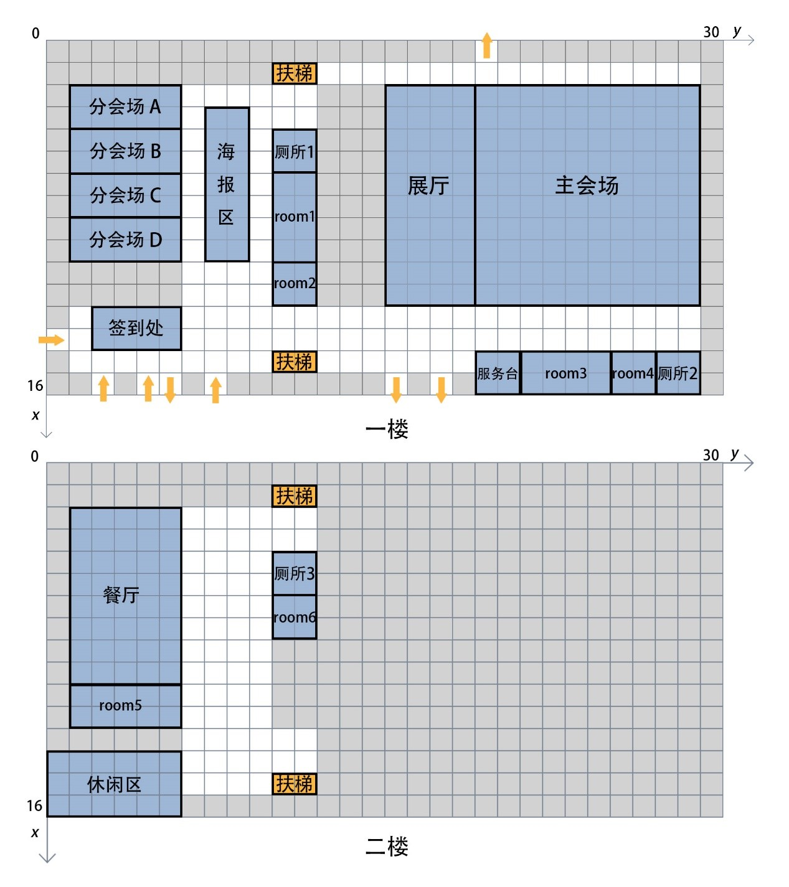

# ChinaVis-2019-challenge-1

[数据可视分析挑战赛 挑战1](http://www.chinavis.org/2019/challenge.html)

在线预览[地址](https://ssdna.github.io/ChinaVis-2019-challenge-1/dist)

## 题目描述

### 背景介绍
CICSC(China Intelligence Cyber Security Conference)（虚构）是一个智能网络安全领域的全国性学术大会，会议旨在增进学界，商界，及社会人士之间的交流与合作，推动该领域的发展创新。本次会议为期三天，包括学术研讨、成果展览、黑客大赛三大组成部分，设置数据安全、物联网安全、移动安全、隐私保护、智能场馆、及智能安全技术创新六大研讨主题。会议期间有多位资深专家和商业大咖带来精彩的主旨报告、经验分享与成果展示，同时还邀请了许多参展单位和媒体记者。本次会议参会人员规模在5000人左右。
为了加强会场管理，也为了呼应“智能场馆安全运营”的会议主题，本次会议采用了无线传感器技术获取参会人员的实时位置信息。参会人员在进入会场时需要佩戴电子胸牌，胸牌内置信号发射器并绑定其个人信息。会场内布置的无线传感器可以实时接收并记录其覆盖范围内的信号发射器发出的信号。采集的传感器数据可用于实时检测会场人群分布情况，便于会场管理人员及时合理地调动资源，处理各种突发状况，为会议各项议题的顺利进行保驾护航。会议组委会临时成立了一个数据分析小组，负责分析这些传感器数据，协助组委会管理会场，响应和处理各类应急事件。假设您是数据分析小组成员，请您设计并实现一套数据可视分析解决方案，完成组委会交代的数据分析任务。

### 数据介绍
本次比赛提供两份数据，一是场馆内部的传感器分布数据，记录了传感器在场馆内布置的具体位置；二是传感器日志数据，记录了会议期间每个传感器收集的参会人员移动信息。
1.	传感器分布数据

传感器分布数据包括传感器布置地图和传感器布置表。传感器布置地图如图1所示：

图1 会场与传感器布置地图

传感器布置地图中，每个单位格子的长度为8米，场馆使用的传感器单体可以覆盖一个8×8米的正方形区域。其中，灰色格子不可通行，除此之外，其他区域均按照8米间隔紧密铺设了传感器。即每个传感器可以接收到其所处正方形格子区域内的信号器发射的信号。

传感器布置表有470行记录，每条记录有4个字段，各字段对应含义如表1所示。比如，（012, 1, 4, 3）表示id为012的传感器位于场馆一楼纵向（从上到下）第4格，横向（从左到右）第3格的位置。

表1. 传感器布置表
字段名称| 字段含义
---|---
sid| 传感器id
floor| 传感器所在楼层
x| 传感器横坐标位置
y| 传感器纵坐标位置

2.	传感器日志数据

传感器日志数据以CSV格式分三天给出，为了避免数据冗余，该数据只保留了人员产生位置变化时的传感器日志数据,数据有3个字段，共计1,879,488行，未压缩约32MB。
各字段含义如表2所示：

表2. 传感器日志表
字段名称|	字段含义|	字段说明
---|---|---
id|	人员id编号|	
sid|	传感器id编号|	
time|	当前时间|	24小时制，单位：秒。从每天00:00:00（00时00分00秒）更新

例：
```
day1: 
17647，012,32400 
17647，013,32500
……
```
表示会议第一天，id为17647的人员,在第32400秒（即上午09：00：00）时进入012传感器的检测范围，随后在该传感器检测范围内停留了100秒，直到32500秒（即上午09：01：40）时进入013传感器检测范围。

### 题目说明 
- （1）请您通过分析数据，推测会议期间主会场和各分会场的日程安排。（建议参赛者回答此题文字不多于800字，图片不多于5张）
- （2）请您分析会议期间会场内的人员类型，总结各类型人员的移动规律。（建议参赛者回答此题文字不多于1000字，图片不多于10张）
- （3）请您找出至少5个会议期间值得关注的异常事件。（建议参赛者回答此题文字不多于1000字，图片不多于10张）
- （4）您认为这次会议在组织和管理方面有哪些不足？（建议参赛者回答此题文字不多于500字，图片不多于3张）


## 分析
1. 各会场安排（简单，各会场的人数变化折线图）
2. 人员类型分析（工作人员、嘉宾、讲师、参会人员）
- 按参会的时间划分（起始时间、时长、）
- 按参会的会场划分（共同参与的会场数量）
- 按参会的移动轨迹划分（相似移动轨迹）
3. 异常事件
- 空间安排不合理（拥挤、厕所排队过久、某会场空间不够、）
- 时间安排不合理（讲座超时、会场切换时间不够）
4. 不足之处
时间
空间

## 功能设计
- 3D可视化（优点：时间和空间动态效果、人员移动轨迹）
- 各会场的人数变化折线图
- 人员类型分析（起始时间、活动位置）

## 技术设计
- vuex只管理应用状态，数据全局存放
- 数据采用csv传输，再处理成json
- three.js 3D场景自动动效